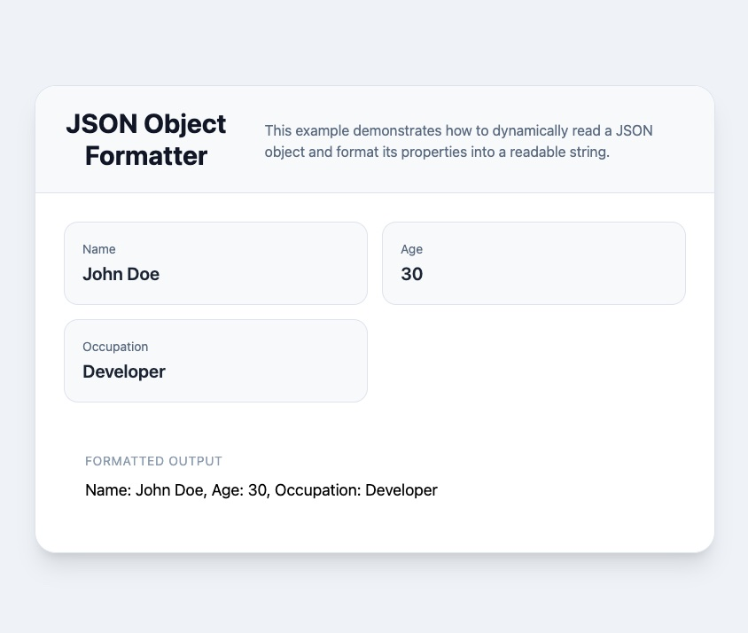

# LEDS - technical test

Hello, this README file is about two technical tests and is aimed at given more context as to what was done:

1. Write a JavaScript function that takes a JSON object as input and returns a formatted string representation of the object.
2. Debug a given JavaScript code snippet that is not working as expected.

## 1. Write a JavaScript function

> Understanding the task:
>
> 1. Take a **JSON Object** as an input
> 2. Reads the **value** inside that object
> 3. Returns a nicely **formatted string**

### Basic javascript solution

The object stores data using **key-values** pairs

```
{
name:  "John Doe",
age:  30,
occupation:  "Developer"
}
```

To access the **values**, we need to give a name to the object, e.g **person** so we can now access the **name** key as follows:

```
person.name
```

which returns

```
John Doe
```

We can now write a **function** following this basic pattern:

```
function functionName(parameter) {
  // code here
}
```

For this coding task, we'll use:

```
function formatPerson(person) {
  // code here
}

// formatPerson = function name
// person = the object passed in the function
```

We can now build the string combining **text** and **templates literals**:

```
`Name: ${person.name}, Age: ${person.age}, Occupation: ${person.occupation}`
```

Putting the function together - using the **return** statement to 'print' what we access via that function:

```
function formatPerson(person) {
  return `Name: ${person.name}, Age: ${person.age}, Occupation: ${person.occupation}`;
}
```

At this point, we can test this function straight into any browser console using the **console.log** statement:

```
const person = {
  name: "John",
  age: 30,
  occupation: "Developer"
};
function formatPerson(person) {
  return `Name: ${person.name}, Age: ${person.age}, Occupation: ${person.occupation}`;
}
console.log(formatPerson(person));
```

This [commit](https://github.com/pierricksenelaer/leds-test/commit/48461338adfc37190de5d1056800f3155f1c6bf7) will show you the finished code with comments to give you context on how it was built

NB: **You can download the repository and use any browser to visualise the formatted string as the script was included in a fully working html file. We use TailwindCSS for its styling.**



### The modern & senior dev solution

Whilst the 'basic solution' works fine, it may not be the optimised way when you think about scalability or if the number of keys grow, or gets updated, hardcoding each one may not be the right solution so looping through the object seems more appropriate and resolve these potential issues.

The solution below uses ES6+ Javascript features and reflect modern javascript features such as

- const (instead of var)
- Arrow functions
- Template literals
- Object.entries()
- Array destructuring
- .map() and .join()
- Modern DOM rendering patterns

This [commit](https://github.com/pierricksenelaer/leds-test/commit/48461338adfc37190de5d1056800f3155f1c6bf7) will show you the finished code with comments to give you context on how it was built
